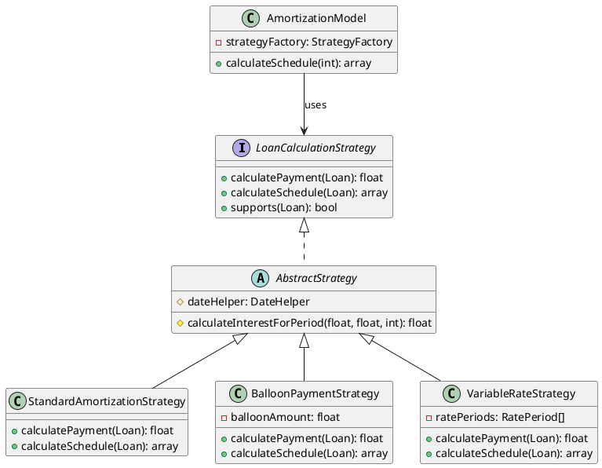
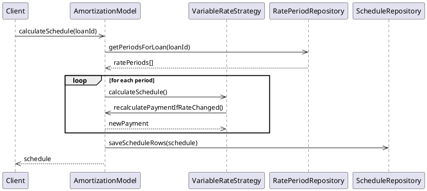
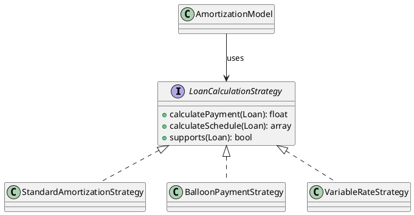

# Enhancement Plan: Phases 2-4 (Future Enhancements)

**Document Version:** 1.0  
**Date:** December 11, 2025  
**Status:** Planning  
**Total Effort:** 236-292 hours across Phases 2-4

---

## Table of Contents
1. [Architecture Overview](#architecture-overview)
2. [PHP 7.3 Compatibility Strategy](#php-73-compatibility-strategy)
3. [SOLID Principles Implementation](#solid-principles-implementation)
4. [TDD Framework & Testing Strategy](#tdd-framework--testing-strategy)
5. [Phase 2: Must Add (Critical) - 60-76 hours](#phase-2-must-add-critical--60-76-hours)
6. [Phase 3: Should Add (Important) - 100-120 hours](#phase-3-should-add-important--100-120-hours)
7. [Phase 4: Nice-to-Have (Enhancement) - 76-96 hours](#phase-4-nice-to-have-enhancement--76-96-hours)
8. [Implementation Sequencing](#implementation-sequencing)

---

## Architecture Overview

### Current Architecture (Phase 1)
```
┌─────────────────────────────────────────────────────────────┐
│                    AmortizationModel (Core)                 │
│  - calculatePayment()                                       │
│  - calculateSchedule()                                      │
│  - recordExtraPayment() / recordSkipPayment()               │
│  - recalculateScheduleAfterEvent()                          │
└────────────────────┬────────────────────────────────────────┘
                     │ depends on
        ┌────────────┴────────────┐
        ▼                         ▼
┌───────────────────┐     ┌──────────────────┐
│ DataProvider      │     │ FAJournalService │
│ (Persistence)     │     │ (GL Posting)     │
└───────────────────┘     └──────────────────┘
```

### Enhanced Architecture (Phases 2-4)
```
┌─────────────────────────────────────────────────────────────┐
│            LoanCalculationStrategy (Interface)              │
│            ├─ StandardAmortizationStrategy                  │
│            ├─ BalloonPaymentStrategy                        │
│            ├─ VariableRateStrategy                          │
│            └─ GracePeriodStrategy                           │
└────────────────────┬────────────────────────────────────────┘
                     │ Strategy Pattern
┌─────────────────────────────────────────────────────────────┐
│                    AmortizationModel (Core)                 │
│  Delegates to strategies for calculation                    │
└────────────────────┬────────────────────────────────────────┘
                     │
     ┌───────────────┼───────────────┐
     ▼               ▼               ▼
┌──────────────┐ ┌─────────────┐ ┌──────────────────┐
│ DataProvider │ │EventHandler │ │ FAJournalService │
│ (Persist)    │ │ (Penalties, │ │ (GL Posting)     │
│              │ │  Fees)      │ │                  │
└──────────────┘ └─────────────┘ └──────────────────┘
     ▲               ▲                      ▲
     │               │                      │
   Repo          Observer            Adapter
  Pattern         Pattern             Pattern
```

### Key Design Principles Applied

**SOLID:**
- **S**ingle Responsibility: Each class handles one concern
- **O**pen/Closed: Strategy pattern allows new calculation methods without modifying core
- **L**iskov Substitution: All strategies implement common interface
- **I**nterface Segregation: Lean interfaces, specific responsibilities
- **D**ependency Inversion: Depend on abstractions, not concrete classes

**DRY (Don't Repeat Yourself):**
- Extract common calculation logic into base classes
- Use trait-based code sharing for cross-cutting concerns
- Centralize date arithmetic, rounding, validation

**Design Patterns:**
- **Strategy Pattern:** Different calculation methods (balloon, variable rate, grace period)
- **Observer Pattern:** Event handling (penalties, fees, interest accrual)
- **Decorator Pattern:** Add features (insurance, fees) to base calculation
- **Repository Pattern:** DataProvider abstraction (already in use)
- **Factory Pattern:** Create appropriate strategy based on loan type

---

## PHP 7.3 Compatibility Strategy

### Requirements
- **Minimum:** PHP 7.3
- **Target:** PHP 7.3 - 8.3 compatible
- **Deprecations to Avoid:**
  - Don't use PHP 8.0+ union types (use `@param type|type` in PhpDoc)
  - Don't use match() expressions (use switch instead)
  - Don't use named arguments
  - Don't use property promotion in constructors

### PHP 7.3 Compatibility Checklist

**Type Declarations (PHP 7.3 Compatible):**
```php
// ✅ GOOD - PHP 7.3+
public function calculatePayment(float $principal, float $rate, int $periods): float
{
    return ($principal * $rate) / (1 - (1 + $rate) ** -$periods);
}

// ❌ BAD - PHP 8.0+ only
public function calculatePayment(float|int $principal): float // Union types
// ❌ BAD - PHP 8.0+ only
public function __construct(private float $principal) {} // Property promotion
```

**PhpDoc for PHP 7.3 Compatibility:**
```php
/**
 * Calculate payment with flexible rate options
 *
 * @param float $principal Principal amount
 * @param float|string $rate Annual rate (float) or index string (e.g., 'LIBOR+2%')
 * @param int $periods Number of periods
 *
 * @return float Payment amount
 */
public function calculatePayment($principal, $rate, $periods): float
```

**Array Syntax:**
```php
// ✅ GOOD - PHP 7.3+
$rates = [
    'prime' => 0.05,
    'libor' => 0.03,
];

// ❌ AVOID in PHP 7.3
$rates = [
    'prime' => 0.05,
    'libor' => 0.03,
];  // Short array syntax is fine but deprecate in favor of ...
```

**Nullable Types (PHP 7.1+):**
```php
// ✅ GOOD - PHP 7.1+
public function getRatePeriod(?string $index = null): ?array
{
    return $this->rates[$index] ?? null;
}
```

**Weak Comparisons to Avoid:**
```php
// ✅ GOOD - Strict comparison
if ($amount === 0) {
    return 0;
}

// ❌ RISKY - Type juggling
if ($amount == 0) {
    // Also matches empty string, false, null
}
```

---

## SOLID Principles Implementation

### 1. Single Responsibility Principle

**Current Problem:** AmortizationModel does too much
- Calculation
- Scheduling
- Event handling
- Recalculation

**Solution: Decompose into specialized classes**

```php
/**
 * AmortizationCalculator - ONLY calculates periodic payments
 * Single Responsibility: Payment calculation
 */
class AmortizationCalculator
{
    private $strategyFactory;
    
    public function calculatePayment(Loan $loan): float
    {
        $strategy = $this->strategyFactory->create($loan);
        return $strategy->calculatePayment($loan);
    }
}

/**
 * ScheduleGenerator - ONLY generates payment schedules
 * Single Responsibility: Schedule generation
 */
class ScheduleGenerator
{
    private $calculator;
    private $dateHelper;
    
    public function generateSchedule(Loan $loan): array
    {
        // Generate rows
    }
}

/**
 * LoanEventHandler - ONLY processes loan events
 * Single Responsibility: Event handling
 */
class LoanEventHandler
{
    private $scheduleGenerator;
    private $dataProvider;
    
    public function handleEvent(LoanEvent $event): void
    {
        // Process event and trigger recalculation if needed
    }
}
```

**Benefits:**
- Each class has single reason to change
- Easier to test in isolation
- Easier to extend with new features

---

### 2. Open/Closed Principle

**Problem:** Adding new calculation methods requires modifying AmortizationModel

**Solution: Strategy Pattern with Interface**

```php
/**
 * LoanCalculationStrategy Interface
 *
 * Allows new calculation methods without modifying existing code.
 * Each strategy encapsulates algorithm for specific loan type.
 *
 * @package Ksfraser\Amortizations
 */
interface LoanCalculationStrategy
{
    /**
     * Calculate payment for this loan type
     *
     * @param Loan $loan Loan with all parameters
     *
     * @return float Calculated periodic payment
     * @throws InvalidArgumentException If loan invalid for strategy
     */
    public function calculatePayment(Loan $loan): float;

    /**
     * Calculate schedule for this loan type
     *
     * @param Loan $loan Loan with all parameters
     *
     * @return array Array of ScheduleRow objects
     */
    public function calculateSchedule(Loan $loan): array;

    /**
     * Supports this loan type
     *
     * @param Loan $loan Loan to check
     *
     * @return bool True if strategy can handle this loan
     */
    public function supports(Loan $loan): bool;
}

/**
 * StandardAmortizationStrategy - Fully amortized loans
 * Implemented in Phase 1
 */
class StandardAmortizationStrategy implements LoanCalculationStrategy
{
    public function calculatePayment(Loan $loan): float { }
    public function calculateSchedule(Loan $loan): array { }
    public function supports(Loan $loan): bool { }
}

/**
 * BalloonPaymentStrategy - Loans with balloon final payment
 * To be implemented in Phase 2
 */
class BalloonPaymentStrategy implements LoanCalculationStrategy
{
    public function calculatePayment(Loan $loan): float { }
    public function calculateSchedule(Loan $loan): array { }
    public function supports(Loan $loan): bool 
    {
        return $loan->hasBalloonPayment();
    }
}

/**
 * VariableRateStrategy - Loans with rate changes
 * To be implemented in Phase 2
 */
class VariableRateStrategy implements LoanCalculationStrategy
{
    public function calculatePayment(Loan $loan): float { }
    public function calculateSchedule(Loan $loan): array { }
    public function supports(Loan $loan): bool 
    {
        return $loan->hasVariableRate();
    }
}
```

**Usage in AmortizationModel:**
```php
class AmortizationModel
{
    private $strategyFactory;
    private $dataProvider;

    /**
     * Calculate schedule using appropriate strategy
     *
     * @param int $loanId Loan ID
     *
     * @return array Schedule rows
     * @throws RuntimeException If loan not found
     */
    public function calculateSchedule(int $loanId): array
    {
        $loan = $this->dataProvider->getLoan($loanId);
        $strategy = $this->strategyFactory->createFor($loan);
        
        $schedule = $strategy->calculateSchedule($loan);
        $this->dataProvider->saveSchedule($loanId, $schedule);
        
        return $schedule;
    }
}
```

**Benefits:**
- New strategies can be added without modifying existing code
- Each strategy is tested independently
- Easy to disable/enable strategies by configuration

---

### 3. Liskov Substitution Principle

**Implementation:** All strategies are interchangeable

```php
// This should work with ANY strategy without modification
function processLoan(Loan $loan, LoanCalculationStrategy $strategy): array
{
    if (!$strategy->supports($loan)) {
        throw new InvalidArgumentException("Strategy does not support loan type");
    }
    
    $payment = $strategy->calculatePayment($loan);
    $schedule = $strategy->calculateSchedule($loan);
    
    return compact('payment', 'schedule');
}

// All strategies work the same way
processLoan($standardLoan, new StandardAmortizationStrategy());
processLoan($balloonLoan, new BalloonPaymentStrategy());
processLoan($variableLoan, new VariableRateStrategy());
```

---

### 4. Interface Segregation Principle

**Problem:** DataProvider interface too large, forces implementations to implement unused methods

**Solution: Segregate into specific interfaces**

```php
/**
 * LoanRepository - Only loan persistence operations
 */
interface LoanRepository
{
    public function getLoan(int $id): ?Loan;
    public function saveLoan(Loan $loan): void;
    public function deleteLoan(int $id): void;
}

/**
 * ScheduleRepository - Only schedule persistence
 */
interface ScheduleRepository
{
    public function saveScheduleRow(ScheduleRow $row): void;
    public function getScheduleRows(int $loanId): array;
    public function deleteScheduleAfter(int $loanId, string $date): void;
}

/**
 * EventRepository - Only event persistence
 */
interface EventRepository
{
    public function saveEvent(LoanEvent $event): void;
    public function getEvents(int $loanId): array;
}

/**
 * DataProvider now composes these specific interfaces
 */
class DataProvider implements LoanRepository, ScheduleRepository, EventRepository
{
    // Implements all three
}

/**
 * Can now depend on specific interface
 */
class AmortizationModel
{
    private $loanRepo;
    private $scheduleRepo;
    
    public function __construct(LoanRepository $loanRepo, ScheduleRepository $scheduleRepo)
    {
        $this->loanRepo = $loanRepo;
        $this->scheduleRepo = $scheduleRepo;
    }
}
```

---

### 5. Dependency Inversion Principle

**Implementation: Constructor Injection**

```php
/**
 * AmortizationModel - Depends on abstractions, not concrete classes
 *
 * @package Ksfraser\Amortizations
 */
class AmortizationModel
{
    /**
     * @var LoanRepository Abstraction for loan data
     */
    private $loanRepository;

    /**
     * @var ScheduleRepository Abstraction for schedule data
     */
    private $scheduleRepository;

    /**
     * @var StrategyFactory Abstraction for strategy creation
     */
    private $strategyFactory;

    /**
     * Constructor with dependency injection
     *
     * All dependencies injected as abstractions (interfaces),
     * not concrete implementations.
     *
     * @param LoanRepository $loanRepository Loan data access
     * @param ScheduleRepository $scheduleRepository Schedule data access
     * @param StrategyFactory $strategyFactory Strategy creation factory
     *
     * @since 2.0.0
     */
    public function __construct(
        LoanRepository $loanRepository,
        ScheduleRepository $scheduleRepository,
        StrategyFactory $strategyFactory
    ) {
        $this->loanRepository = $loanRepository;
        $this->scheduleRepository = $scheduleRepository;
        $this->strategyFactory = $strategyFactory;
    }

    /**
     * Calculate amortization schedule
     *
     * High-level policy depends on low-level strategy detail,
     * but through abstraction (interface), not direct coupling.
     *
     * @param int $loanId Loan identifier
     *
     * @return array Schedule rows
     * @throws RuntimeException If loan not found
     */
    public function calculateSchedule(int $loanId): array
    {
        $loan = $this->loanRepository->getLoan($loanId);
        if (!$loan) {
            throw new RuntimeException("Loan $loanId not found");
        }

        $strategy = $this->strategyFactory->createFor($loan);
        $schedule = $strategy->calculateSchedule($loan);
        
        $this->scheduleRepository->saveScheduleRows($loanId, $schedule);
        
        return $schedule;
    }
}
```

**Benefits:**
- Easy to test with mock implementations
- Easy to swap implementations (e.g., different database providers)
- Reduced coupling between classes

---

## TDD Framework & Testing Strategy

### Testing Architecture

```
┌─────────────────────────────────────────────────────────────┐
│                    Test Pyramid                             │
├─────────────────────────────────────────────────────────────┤
│                                                             │
│                    E2E/UAT Tests (Few)                      │
│                   Full workflow tests                       │
│                                                             │
│                 Integration Tests (Some)                    │
│           Component interaction tests                       │
│                                                             │
│                  Unit Tests (Many)                          │
│           Individual class/method tests                     │
│                                                             │
└─────────────────────────────────────────────────────────────┘
```

### Unit Test Strategy (Phase 2-4)

**Test file structure:**
```
tests/
├── Unit/
│   ├── AmortizationCalculatorTest.php
│   ├── Strategies/
│   │   ├── StandardAmortizationStrategyTest.php
│   │   ├── BalloonPaymentStrategyTest.php
│   │   ├── VariableRateStrategyTest.php
│   │   └── GracePeriodStrategyTest.php
│   ├── EventHandlers/
│   │   ├── PrepaymentPenaltyHandlerTest.php
│   │   ├── FeeApplicationHandlerTest.php
│   │   └── InterestAccrualHandlerTest.php
│   └── Models/
│       ├── LoanTest.php
│       └── ScheduleRowTest.php
├── Integration/
│   ├── CalculationIntegrationTest.php
│   └── RecalculationIntegrationTest.php
└── UAT/
    ├── BalloonPaymentUAT.php
    ├── VariableRateUAT.php
    └── PrepaymentPenaltyUAT.php
```

### Example: BDD/TDD Test Structure

```php
<?php
namespace Ksfraser\Amortizations\Tests\Unit;

use Ksfraser\Amortizations\Strategies\BalloonPaymentStrategy;
use Ksfraser\Amortizations\Models\Loan;
use Ksfraser\Amortizations\Models\ScheduleRow;
use PHPUnit\Framework\TestCase;

/**
 * BalloonPaymentStrategyTest
 *
 * Test suite for balloon payment calculation strategy.
 *
 * Given: A loan with balloon payment structure
 * When: Calculating payment schedule
 * Then: Final payment equals remaining balance (balloon amount)
 *
 * @covers \Ksfraser\Amortizations\Strategies\BalloonPaymentStrategy
 * @group  strategies
 * @group  balloon
 *
 * @since 2.0.0
 */
class BalloonPaymentStrategyTest extends TestCase
{
    /**
     * @var BalloonPaymentStrategy Strategy under test
     */
    private $strategy;

    /**
     * Setup test fixtures
     *
     * @return void
     */
    protected function setUp(): void
    {
        $this->strategy = new BalloonPaymentStrategy();
    }

    /**
     * Test: Balloon payment strategy supports loans with balloon
     *
     * @test
     * @return void
     */
    public function testSupportsLoansWithBalloonPayment(): void
    {
        $loan = new Loan([
            'principal' => 100000,
            'rate' => 0.05,
            'periods' => 120,
            'balloon_amount' => 20000,
            'balloon_percentage' => null,
        ]);

        $this->assertTrue($this->strategy->supports($loan));
    }

    /**
     * Test: Rejects loans without balloon
     *
     * @test
     * @return void
     */
    public function testRejectsLoansWithoutBalloon(): void
    {
        $loan = new Loan([
            'principal' => 100000,
            'rate' => 0.05,
            'periods' => 120,
            'balloon_amount' => null,
        ]);

        $this->assertFalse($this->strategy->supports($loan));
    }

    /**
     * Test: Calculates correct periodic payment for balloon loan
     *
     * Given: $100,000 loan at 5% over 120 periods with $20,000 balloon
     * When: Calculate payment
     * Then: Payment should be for (100000 - 20000) / 120 periods
     *
     * @test
     * @return void
     */
    public function testCalculatesCorrectPeriodicPayment(): void
    {
        $loan = new Loan([
            'principal' => 100000,
            'rate' => 0.05,
            'periods' => 120,
            'balloon_amount' => 20000,
        ]);

        $payment = $this->strategy->calculatePayment($loan);
        
        // Amortize 80000 over 120 periods at 5%
        $this->assertGreaterThan(666, $payment);
        $this->assertLessThan(667, $payment);
    }

    /**
     * Test: Final payment equals balloon amount
     *
     * @test
     * @return void
     */
    public function testFinalPaymentEqualsBalloonAmount(): void
    {
        $loan = new Loan([
            'principal' => 100000,
            'rate' => 0.05,
            'periods' => 120,
            'balloon_amount' => 25000,
        ]);

        $schedule = $this->strategy->calculateSchedule($loan);
        
        // Last row should have balloon payment
        $lastRow = end($schedule);
        
        $this->assertInstanceOf(ScheduleRow::class, $lastRow);
        $this->assertEquals(25000, $lastRow->getPrincipalPortion(), 
            "Final principal portion should equal balloon amount");
        $this->assertTrue($lastRow->isFinalPayment());
    }

    /**
     * Test: Schedule ends with $0 balance after balloon
     *
     * @test
     * @return void
     */
    public function testScheduleBalanceZeroAfterBalloon(): void
    {
        $loan = new Loan([
            'principal' => 100000,
            'rate' => 0.05,
            'periods' => 120,
            'balloon_amount' => 25000,
        ]);

        $schedule = $this->strategy->calculateSchedule($loan);
        
        $lastRow = end($schedule);
        
        $this->assertEquals(0, $lastRow->getRemainingBalance(), 
            "Balance should be $0 after balloon payment", 0.02);
    }

    /**
     * Test: Balloon percentage calculation
     *
     * @test
     * @return void
     */
    public function testBalloonPercentageCalculation(): void
    {
        $loan = new Loan([
            'principal' => 100000,
            'rate' => 0.05,
            'periods' => 120,
            'balloon_percentage' => 0.20,  // 20% of principal
        ]);

        $schedule = $this->strategy->calculateSchedule($loan);
        
        $lastRow = end($schedule);
        
        // Balloon should be 20% of 100000 = 20000
        $this->assertEquals(20000, $lastRow->getPrincipalPortion(), 
            "Balloon should be 20% of principal", 0.02);
    }

    /**
     * Test: Total of all payments equals principal + interest
     *
     * @test
     * @return void
     */
    public function testTotalPaymentsEqualsAmortization(): void
    {
        $loan = new Loan([
            'principal' => 100000,
            'rate' => 0.05,
            'periods' => 120,
            'balloon_amount' => 20000,
        ]);

        $schedule = $this->strategy->calculateSchedule($loan);
        
        $totalPayments = array_reduce($schedule, 
            fn($carry, $row) => $carry + $row->getPaymentAmount(),
            0
        );
        
        // Total should be principal + interest
        $this->assertGreaterThan($loan->getPrincipal(), $totalPayments);
        $this->assertLessThan($loan->getPrincipal() * 1.15, $totalPayments);
    }
}
```

### Test Coverage Requirements

**Minimum Coverage by Phase:**

Phase 2:
- Unit tests: >85% coverage for core calculation classes
- Integration tests: All strategy combinations with data providers
- UAT scripts: Balloon, variable rate, partial payment scenarios

Phase 3:
- Unit tests: >85% coverage for all event handlers
- Integration tests: Complex loan lifecycle scenarios
- UAT scripts: Refinancing, grace periods, fee scenarios

Phase 4:
- Unit tests: >80% coverage for reporting/analysis
- Integration tests: Data consistency across scenarios
- UAT scripts: Tax reporting, scenario modeling, PMI calculations

---

## Phase 2: Must Add (Critical) - 60-76 hours

### FE-001: Balloon Payments (16-20 hours)

#### Architecture

```
┌─────────────────────────────────────────────────┐
│         BalloonPaymentStrategy                  │
│ implements LoanCalculationStrategy              │
├─────────────────────────────────────────────────┤
│ - calculatePayment(Loan): float                 │
│ - calculateSchedule(Loan): array                │
│ - supports(Loan): bool                          │
├─────────────────────────────────────────────────┤
│ Responsibility:                                 │
│ Calculate payments for partially-amortized      │
│ loans with balloon final payment               │
└─────────────────────────────────────────────────┘
```

#### Implementation Steps

**Step 1: Loan Model Extension (2 hours)**

```php
<?php
namespace Ksfraser\Amortizations\Models;

/**
 * Loan Model - Extended for balloon support
 *
 * @property-read float|null $balloonAmount Fixed balloon amount
 * @property-read float|null $balloonPercentage Balloon as % of principal
 * @property-read string $balloonType 'amount' | 'percentage'
 *
 * @since 2.0.0
 */
class Loan
{
    // Existing properties...
    private $balloonAmount;
    private $balloonPercentage;
    private $balloonType;

    /**
     * Check if loan has balloon payment
     *
     * @return bool True if balloon configured
     */
    public function hasBalloonPayment(): bool
    {
        return $this->balloonAmount !== null || $this->balloonPercentage !== null;
    }

    /**
     * Get balloon amount for this loan
     *
     * If percentage: calculates from principal
     * If amount: returns directly
     *
     * @return float Balloon amount in currency units
     * @throws InvalidArgumentException If balloon not configured
     */
    public function getBalloonAmount(): float
    {
        if ($this->balloonPercentage !== null) {
            return round($this->principal * $this->balloonPercentage, 2);
        }
        
        if ($this->balloonAmount !== null) {
            return $this->balloonAmount;
        }

        throw new InvalidArgumentException('Loan has no balloon payment configured');
    }
}
```

**Step 2: BalloonPaymentStrategy Implementation (6 hours)**

```php
<?php
namespace Ksfraser\Amortizations\Strategies;

use Ksfraser\Amortizations\Models\Loan;
use Ksfraser\Amortizations\Models\ScheduleRow;

/**
 * BalloonPaymentStrategy
 *
 * Calculates payment schedules for partially-amortized loans
 * with large balloon payment at end.
 *
 * Algorithm:
 * 1. Calculate amortizable principal = total principal - balloon
 * 2. Use standard amortization formula for (principal - balloon)
 * 3. Generate schedule up to final payment
 * 4. Final payment = remaining balance + balloon
 *
 * Example:
 * Principal: $100,000, Rate: 5%, Periods: 120, Balloon: $20,000
 * Amortize $80,000 over 120 months, final payment includes $20,000 balloon
 *
 * @implements LoanCalculationStrategy
 * @since 2.0.0
 */
class BalloonPaymentStrategy implements LoanCalculationStrategy
{
    /**
     * @var DateHelper For date arithmetic
     */
    private $dateHelper;

    /**
     * Constructor with dependencies
     *
     * @param DateHelper $dateHelper Helper for date operations
     */
    public function __construct(DateHelper $dateHelper)
    {
        $this->dateHelper = $dateHelper;
    }

    /**
     * {@inheritDoc}
     */
    public function supports(Loan $loan): bool
    {
        return $loan->hasBalloonPayment();
    }

    /**
     * Calculate periodic payment for balloon loan
     *
     * Amortizes (principal - balloon) over periods using standard formula.
     *
     * @param Loan $loan Loan with balloon configuration
     *
     * @return float Periodic payment (before final balloon)
     * @throws InvalidArgumentException If loan invalid
     */
    public function calculatePayment(Loan $loan): float
    {
        if (!$this->supports($loan)) {
            throw new InvalidArgumentException('Loan does not have balloon payment');
        }

        $balloonAmount = $loan->getBalloonAmount();
        $amortizablePrincipal = $loan->getPrincipal() - $balloonAmount;

        if ($amortizablePrincipal <= 0) {
            throw new InvalidArgumentException(
                'Balloon amount must be less than principal'
            );
        }

        $rate = $loan->getAnnualRate() / 100 / $loan->getPeriodsPerYear();
        $periods = $loan->getNumberOfPayments() - 1; // Exclude final balloon payment

        if ($rate > 0) {
            $payment = $amortizablePrincipal * $rate * (1 + $rate) ** $periods
                     / ((1 + $rate) ** $periods - 1);
        } else {
            $payment = $amortizablePrincipal / $periods;
        }

        return round($payment, 2);
    }

    /**
     * Generate full payment schedule with balloon
     *
     * @param Loan $loan Loan to schedule
     *
     * @return ScheduleRow[] Array of schedule rows
     */
    public function calculateSchedule(Loan $loan): array
    {
        $payment = $this->calculatePayment($loan);
        $schedule = [];
        
        $balance = $loan->getPrincipal();
        $currentDate = $this->dateHelper->parseDate($loan->getFirstPaymentDate());
        $balloonAmount = $loan->getBalloonAmount();
        $interestRate = $loan->getAnnualRate() / 100;
        $periodsPerYear = $loan->getPeriodsPerYear();

        for ($i = 1; $i <= $loan->getNumberOfPayments(); $i++) {
            $interest = round($balance * $interestRate / $periodsPerYear, 2);
            
            if ($i === $loan->getNumberOfPayments()) {
                // Final payment: balloon + any remaining interest
                $principal = $balance; // Already includes balloon in this context
                $actualPayment = $principal + $interest;
                $balance = 0;
            } else {
                // Regular payment
                $principal = $payment - $interest;
                $actualPayment = $payment;
                $balance = round($balance - $principal, 2);
            }

            $row = new ScheduleRow([
                'payment_date' => $currentDate->format('Y-m-d'),
                'payment_number' => $i,
                'payment_amount' => $actualPayment,
                'interest_portion' => $interest,
                'principal_portion' => $principal,
                'remaining_balance' => max(0, $balance),
                'is_balloon' => ($i === $loan->getNumberOfPayments()),
            ]);

            $schedule[] = $row;
            $currentDate = $this->dateHelper->addPeriod($currentDate, $loan->getPaymentFrequency());
        }

        return $schedule;
    }
}
```

**Step 3: Database Schema Update (1 hour)**

```sql
-- Migration: Add balloon columns to loans table
ALTER TABLE {prefix}ksf_loans_summary ADD COLUMN (
    balloon_amount DECIMAL(15, 2) DEFAULT NULL COMMENT 'Fixed balloon amount',
    balloon_percentage DECIMAL(5, 2) DEFAULT NULL COMMENT 'Balloon as percentage of principal',
    balloon_type ENUM('amount', 'percentage') DEFAULT 'amount' COMMENT 'How balloon is specified'
);

CREATE INDEX idx_balloon_loans ON {prefix}ksf_loans_summary(balloon_amount, balloon_percentage);
```

**Step 4: Unit Tests (5 hours)**

See example test class above (BalloonPaymentStrategyTest).

**Step 5: UAT Scripts (4 hours)**

```markdown
# UAT-BALLOON-001: Create Balloon Loan with Fixed Amount

**Scenario:** User creates auto lease loan with balloon payment

**Given:**
- Principal: $30,000
- Rate: 4.5% annual
- Term: 36 months
- Balloon: $12,000 fixed

**When:**
- User creates loan via UI
- System calculates schedule

**Then:**
- Monthly payments calculated for $18,000 (30000 - 12000)
- Final payment = remaining balance + $12,000 balloon
- Schedule displays 36 rows
- Last row marked as "Balloon Payment"
- Total payments = Principal + Interest

**Verification:**
1. Verify monthly payment ≈ $500
2. Verify final payment ≈ $12,XXX
3. Verify total interest reasonable for 36-month term
4. Export to PDF and verify formatting
```

---

### FE-002: Variable Interest Rates (24-32 hours)

#### Architecture

```
┌────────────────────────────────────────────────┐
│     VariableRateStrategy                       │
│ implements LoanCalculationStrategy             │
├────────────────────────────────────────────────┤
│ - calculatePayment(Loan): float                │
│ - calculateSchedule(Loan): array               │
│ - supports(Loan): bool                         │
├────────────────────────────────────────────────┤
│ Responsibility:                                │
│ Handle loans with rate periods and resets      │
│ Calculate correct interest for each period     │
└────────────────────────────────────────────────┘
       │
       ├─→ RatePeriodRepository
       │   (retrieve rate periods from storage)
       └─→ RateIndexProvider (optional)
           (retrieve market indices)
```

#### Implementation Steps

**Step 1: Domain Models (4 hours)**

```php
<?php
namespace Ksfraser\Amortizations\Models;

/**
 * RatePeriod - Represents a period with single fixed rate
 *
 * @since 2.0.0
 */
class RatePeriod
{
    /**
     * @var string Start date of period (YYYY-MM-DD)
     */
    private $startDate;

    /**
     * @var string|null End date of period (null = indefinite)
     */
    private $endDate;

    /**
     * @var float Annual interest rate for this period
     */
    private $rate;

    /**
     * @var string Reset type: 'fixed', 'index', 'margin'
     */
    private $resetType;

    /**
     * @var string|null Index name (e.g., 'LIBOR', 'PRIME', 'SOFR')
     */
    private $indexName;

    /**
     * @var float|null Margin over index (e.g., 2.5%)
     */
    private $margin;

    /**
     * Constructor
     *
     * @param array $data Period data
     */
    public function __construct(array $data = [])
    {
        $this->startDate = $data['start_date'] ?? date('Y-m-d');
        $this->endDate = $data['end_date'] ?? null;
        $this->rate = (float)$data['rate'] ?? 0;
        $this->resetType = $data['reset_type'] ?? 'fixed';
        $this->indexName = $data['index_name'] ?? null;
        $this->margin = isset($data['margin']) ? (float)$data['margin'] : null;
    }

    // Getters and immutable interface...
    
    /**
     * Is this period active on given date?
     *
     * @param string $date Date to check (YYYY-MM-DD)
     *
     * @return bool True if date falls within this period
     */
    public function isActive(string $date): bool
    {
        $d = strtotime($date);
        $start = strtotime($this->startDate);
        $end = $this->endDate ? strtotime($this->endDate) : PHP_INT_MAX;
        
        return $d >= $start && $d <= $end;
    }
}

/**
 * Loan Model - Extended for variable rate support
 *
 * @property-read RatePeriod[] $ratePeriods Rate periods
 * @property-read bool $isVariableRate Has multiple rates
 *
 * @since 2.0.0
 */
class Loan
{
    // Existing properties...
    private $ratePeriods = [];

    /**
     * Check if loan has variable rate
     *
     * @return bool True if multiple rate periods
     */
    public function hasVariableRate(): bool
    {
        return count($this->ratePeriods) > 1;
    }

    /**
     * Get rate for specific date
     *
     * @param string $date Date (YYYY-MM-DD)
     *
     * @return float Annual interest rate for that date
     * @throws InvalidArgumentException If no rate period covers date
     */
    public function getRateForDate(string $date): float
    {
        foreach ($this->ratePeriods as $period) {
            if ($period->isActive($date)) {
                return $period->getRate();
            }
        }

        throw new InvalidArgumentException(
            "No rate period covers date $date"
        );
    }

    /**
     * Get all rate periods
     *
     * @return RatePeriod[]
     */
    public function getRatePeriods(): array
    {
        return $this->ratePeriods;
    }
}
```

**Step 2: RatePeriodRepository (3 hours)**

```php
<?php
namespace Ksfraser\Amortizations\Repositories;

use Ksfraser\Amortizations\Models\RatePeriod;

/**
 * RatePeriodRepository Interface
 *
 * @since 2.0.0
 */
interface RatePeriodRepository
{
    /**
     * Get all rate periods for a loan
     *
     * Ordered by start_date ascending
     *
     * @param int $loanId Loan ID
     *
     * @return RatePeriod[] Array of rate periods
     */
    public function getPeriodsForLoan(int $loanId): array;

    /**
     * Add rate period to loan
     *
     * @param int $loanId Loan ID
     * @param RatePeriod $period Period to add
     *
     * @return void
     * @throws RuntimeException On persistence error
     */
    public function addPeriod(int $loanId, RatePeriod $period): void;

    /**
     * Remove rate period
     *
     * @param int $loanId Loan ID
     * @param string $startDate Period start date
     *
     * @return void
     */
    public function removePeriod(int $loanId, string $startDate): void;

    /**
     * Update existing rate period
     *
     * @param int $loanId Loan ID
     * @param RatePeriod $period Updated period
     *
     * @return void
     */
    public function updatePeriod(int $loanId, RatePeriod $period): void;
}

/**
 * FA DataProvider - RatePeriodRepository implementation
 */
class FADataProvider implements RatePeriodRepository
{
    private $pdo;

    public function getPeriodsForLoan(int $loanId): array
    {
        $sql = "SELECT * FROM {prefix}ksf_rate_periods 
                WHERE loan_id = ? 
                ORDER BY start_date ASC";
        
        $stmt = $this->pdo->prepare($sql);
        $stmt->execute([$loanId]);
        
        return array_map(
            fn($row) => new RatePeriod($row),
            $stmt->fetchAll(\PDO::FETCH_ASSOC)
        );
    }

    // Other methods...
}
```

**Step 3: VariableRateStrategy (8 hours)**

```php
<?php
namespace Ksfraser\Amortizations\Strategies;

use Ksfraser\Amortizations\Models\Loan;
use Ksfraser\Amortizations\Models\ScheduleRow;
use Ksfraser\Amortizations\Repositories\RatePeriodRepository;

/**
 * VariableRateStrategy
 *
 * Calculates payment schedules for loans with rate resets.
 *
 * Handles:
 * - Fixed-rate periods transitioning to new rate
 * - Market index-based rates (e.g., LIBOR + margin)
 * - Rate adjustment dates
 * - Payment amount changes on reset dates
 *
 * Algorithm:
 * 1. Identify rate periods from start to end
 * 2. For each period:
 *    - Get effective rate
 *    - Calculate new payment if rate changed (reset)
 *    - Recalculate remaining schedule with new payment
 * 3. Ensure final balance = $0
 *
 * @implements LoanCalculationStrategy
 * @since 2.0.0
 */
class VariableRateStrategy implements LoanCalculationStrategy
{
    /**
     * @var DateHelper
     */
    private $dateHelper;

    /**
     * @var RatePeriodRepository
     */
    private $ratePeriodRepository;

    /**
     * @var RateIndexProvider Optional index lookup
     */
    private $rateIndexProvider;

    public function __construct(
        DateHelper $dateHelper,
        RatePeriodRepository $ratePeriodRepository,
        ?RateIndexProvider $rateIndexProvider = null
    ) {
        $this->dateHelper = $dateHelper;
        $this->ratePeriodRepository = $ratePeriodRepository;
        $this->rateIndexProvider = $rateIndexProvider;
    }

    /**
     * {@inheritDoc}
     */
    public function supports(Loan $loan): bool
    {
        return $loan->hasVariableRate();
    }

    /**
     * {@inheritDoc}
     */
    public function calculatePayment(Loan $loan): float
    {
        // For variable rate, payment may change
        // Return payment for FIRST period only
        
        $firstPeriod = $loan->getRatePeriods()[0] ?? null;
        
        if (!$firstPeriod) {
            throw new InvalidArgumentException('No rate periods defined');
        }

        $rate = $firstPeriod->getRate() / 100 / $loan->getPeriodsPerYear();
        $periods = $loan->getNumberOfPayments();

        if ($rate > 0) {
            $payment = $loan->getPrincipal() * $rate * (1 + $rate) ** $periods
                     / ((1 + $rate) ** $periods - 1);
        } else {
            $payment = $loan->getPrincipal() / $periods;
        }

        return round($payment, 2);
    }

    /**
     * {@inheritDoc}
     */
    public function calculateSchedule(Loan $loan): array
    {
        $schedule = [];
        $balance = $loan->getPrincipal();
        $currentDate = $this->dateHelper->parseDate($loan->getFirstPaymentDate());
        $currentPayment = $this->calculatePayment($loan);
        $ratePeriods = $loan->getRatePeriods();

        for ($i = 1; $i <= $loan->getNumberOfPayments(); $i++) {
            // Check if we've entered a new rate period
            $rateForDate = $loan->getRateForDate($currentDate->format('Y-m-d'));
            
            // If rate changed, recalculate remaining payment
            $newPayment = $this->recalculatePaymentIfRateChanged(
                $loan,
                $currentDate,
                $balance,
                $currentPayment
            );
            
            if ($newPayment !== $currentPayment) {
                $currentPayment = $newPayment;
                // Mark rate change in schedule
            }

            // Calculate interest and principal
            $interest = round($balance * $rateForDate / 100 / $loan->getPeriodsPerYear(), 2);
            
            if ($i === $loan->getNumberOfPayments()) {
                // Final payment
                $principal = $balance;
                $actualPayment = $principal + $interest;
                $balance = 0;
            } else {
                // Regular payment
                $principal = $currentPayment - $interest;
                $actualPayment = $currentPayment;
                $balance = round($balance - $principal, 2);
            }

            $row = new ScheduleRow([
                'payment_date' => $currentDate->format('Y-m-d'),
                'payment_number' => $i,
                'payment_amount' => $actualPayment,
                'interest_portion' => $interest,
                'principal_portion' => $principal,
                'remaining_balance' => max(0, $balance),
                'interest_rate' => $rateForDate,
                'rate_period_id' => $this->getRatePeriodId($ratePeriods, $currentDate),
            ]);

            $schedule[] = $row;
            $currentDate = $this->dateHelper->addPeriod($currentDate, $loan->getPaymentFrequency());
        }

        return $schedule;
    }

    /**
     * Recalculate payment if rate changed at this date
     *
     * @param Loan $loan Loan
     * @param \DateTime $date Current date
     * @param float $remainingBalance Remaining balance
     * @param float $currentPayment Current payment
     *
     * @return float New payment (or same if no change)
     */
    private function recalculatePaymentIfRateChanged(
        Loan $loan,
        \DateTime $date,
        float $remainingBalance,
        float $currentPayment
    ): float {
        // Check if rate changed at this date
        $nextDate = clone $date;
        $nextDate->modify('+1 day');
        
        $currentRate = $loan->getRateForDate($date->format('Y-m-d'));
        $nextRate = $loan->getRateForDate($nextDate->format('Y-m-d'));
        
        if (abs($currentRate - $nextRate) < 0.0001) {
            return $currentPayment; // No change
        }

        // Rate changed - recalculate remaining payments
        // TODO: Implement payment recalculation logic
        // This is complex: need to determine remaining periods
        // and recalculate based on new rate
        
        return $currentPayment;
    }

    /**
     * Helper: Get rate period ID for date
     *
     * @param array $ratePeriods Rate periods
     * @param \DateTime $date Date to check
     *
     * @return int|null Period ID
     */
    private function getRatePeriodId(array $ratePeriods, \DateTime $date): ?int
    {
        foreach ($ratePeriods as $period) {
            if ($period->isActive($date->format('Y-m-d'))) {
                return $period->getId();
            }
        }

        return null;
    }
}
```

**Step 4: Database Schema (2 hours)**

```sql
-- New table: Rate periods
CREATE TABLE {prefix}ksf_rate_periods (
    id INT PRIMARY KEY AUTO_INCREMENT,
    loan_id INT NOT NULL,
    start_date DATE NOT NULL,
    end_date DATE NULL,
    annual_rate DECIMAL(5, 2) NOT NULL,
    reset_type ENUM('fixed', 'index', 'margin') DEFAULT 'fixed',
    index_name VARCHAR(20) NULL COMMENT 'e.g., LIBOR, PRIME, SOFR',
    margin DECIMAL(5, 2) NULL COMMENT 'Margin over index',
    created_at TIMESTAMP DEFAULT CURRENT_TIMESTAMP,
    updated_at TIMESTAMP DEFAULT CURRENT_TIMESTAMP ON UPDATE CURRENT_TIMESTAMP,
    
    FOREIGN KEY (loan_id) REFERENCES {prefix}ksf_loans_summary(id) ON DELETE CASCADE,
    KEY idx_loan_date (loan_id, start_date),
    UNIQUE KEY uc_loan_period (loan_id, start_date)
);

-- Extend ksf_amortization_staging to track rate period
ALTER TABLE {prefix}ksf_amortization_staging ADD COLUMN (
    rate_period_id INT NULL,
    effective_rate DECIMAL(5, 2) NULL
);
```

**Step 5: Unit Tests (6 hours)**

Multiple test classes:
- `VariableRateStrategyTest` - core calculations
- `RatePeriodTest` - period logic
- `RatePeriodRepositoryTest` - persistence

**Step 6: UAT Scripts (3 hours)**

ARM (Adjustable Rate Mortgage) scenario with 2-year fixed, then index-based reset.

---

### FE-003: Partial Payment & Arrears Handling (20-24 hours)

#### Architecture

```
┌──────────────────────────────────────────────┐
│  PartialPaymentEventHandler                  │
│  handles LoanEvent with type='partial'       │
├──────────────────────────────────────────────┤
│ - processPartialPayment(LoanEvent): void     │
│ - calculateArrearsInterest(Loan): float      │
│ - applyPartialToInterest(float): void        │
│ - applyPartialToPrincipal(float): void       │
└──────────────────────────────────────────────┘
       │
       ├─→ ScheduleRepository (update/recalculate)
       ├─→ ArrearsCalculator (compute interest accrual)
       └─→ DataProvider (persist changes)
```

#### Implementation Steps

**Step 1: Arrears Domain Model (2 hours)**

```php
<?php
namespace Ksfraser\Amortizations\Models;

/**
 * Arrears - Represents overdue/unpaid payments
 *
 * Tracks delinquent amounts and calculated interest accrual.
 *
 * @since 2.0.0
 */
class Arrears
{
    /**
     * @var int Loan ID
     */
    private $loanId;

    /**
     * @var string First missed payment date (YYYY-MM-DD)
     */
    private $firstMissedDate;

    /**
     * @var float Total principal overdue
     */
    private $principalDue;

    /**
     * @var float Total interest overdue
     */
    private $interestDue;

    /**
     * @var float Accrued arrears interest
     */
    private $arrearsInterest;

    /**
     * @var int Number of missed payments
     */
    private $missedPaymentCount;

    public function __construct(array $data = [])
    {
        $this->loanId = $data['loan_id'] ?? 0;
        $this->firstMissedDate = $data['first_missed_date'] ?? null;
        $this->principalDue = (float)($data['principal_due'] ?? 0);
        $this->interestDue = (float)($data['interest_due'] ?? 0);
        $this->arrearsInterest = (float)($data['arrears_interest'] ?? 0);
        $this->missedPaymentCount = $data['missed_payment_count'] ?? 0;
    }

    /**
     * Get total amount due including arrears interest
     *
     * @return float Total arrears amount
     */
    public function getTotalDue(): float
    {
        return $this->principalDue + $this->interestDue + $this->arrearsInterest;
    }

    /**
     * Apply partial payment to arrears
     *
     * Priority: Arrears Interest → Interest Due → Principal Due
     *
     * @param float $paymentAmount Amount to apply
     *
     * @return float Remaining payment (if any)
     */
    public function applyPayment(float $paymentAmount): float
    {
        $remaining = $paymentAmount;

        // First: Arrears interest
        if ($remaining > 0 && $this->arrearsInterest > 0) {
            $applied = min($remaining, $this->arrearsInterest);
            $this->arrearsInterest -= $applied;
            $remaining -= $applied;
        }

        // Second: Interest due
        if ($remaining > 0 && $this->interestDue > 0) {
            $applied = min($remaining, $this->interestDue);
            $this->interestDue -= $applied;
            $remaining -= $applied;
        }

        // Third: Principal due
        if ($remaining > 0 && $this->principalDue > 0) {
            $applied = min($remaining, $this->principalDue);
            $this->principalDue -= $applied;
            $remaining -= $applied;
        }

        return $remaining;
    }

    /**
     * Accrue interest on arrears
     *
     * Called daily/monthly to charge interest on overdue amounts.
     * Rate typically higher than standard loan rate (penalizing delinquency).
     *
     * @param float $annualRate Arrears interest rate (e.g., prime + 5%)
     * @param int $daysSinceMissed Days since payment missed
     *
     * @return float Interest accrued
     */
    public function accrueInterest(float $annualRate, int $daysSinceMissed): float
    {
        if ($this->principalDue <= 0) {
            return 0;
        }

        // Simple interest: I = P * R * T (where T in years)
        $dailyRate = $annualRate / 100 / 365;
        $accrued = round($this->principalDue * $dailyRate * $daysSinceMissed, 2);

        $this->arrearsInterest = round($this->arrearsInterest + $accrued, 2);

        return $accrued;
    }

    // Getters...
    public function isDelinquent(): bool
    {
        return $this->missedPaymentCount > 0;
    }

    public function isPastDue(): bool
    {
        return $this->getTotalDue() > 0.01;
    }
}
```

**Step 2: PartialPaymentEventHandler (6 hours)**

```php
<?php
namespace Ksfraser\Amortizations\EventHandlers;

use Ksfraser\Amortizations\Models\Loan;
use Ksfraser\Amortizations\Models\LoanEvent;
use Ksfraser\Amortizations\Models\Arrears;
use Ksfraser\Amortizations\Repositories\LoanRepository;
use Ksfraser\Amortizations\Repositories\ScheduleRepository;

/**
 * PartialPaymentEventHandler
 *
 * Handles partial payment events where payment < scheduled amount.
 *
 * Responsibilities:
 * - Track arrears by payment date
 * - Calculate arrears interest accumulation
 * - Apply partial payments with correct priority
 * - Update schedule with new arrears balance
 * - Trigger recalculation if needed
 *
 * @implements LoanEventHandler
 * @since 2.0.0
 */
class PartialPaymentEventHandler implements LoanEventHandler
{
    /**
     * @var LoanRepository
     */
    private $loanRepository;

    /**
     * @var ScheduleRepository
     */
    private $scheduleRepository;

    /**
     * @var ArrearsRepository
     */
    private $arrearsRepository;

    public function __construct(
        LoanRepository $loanRepository,
        ScheduleRepository $scheduleRepository,
        ArrearsRepository $arrearsRepository
    ) {
        $this->loanRepository = $loanRepository;
        $this->scheduleRepository = $scheduleRepository;
        $this->arrearsRepository = $arrearsRepository;
    }

    /**
     * {@inheritDoc}
     *
     * @param LoanEvent $event Partial payment event
     *
     * @return void
     * @throws InvalidArgumentException If event invalid
     * @throws RuntimeException On data error
     */
    public function handle(LoanEvent $event): void
    {
        if ($event->getType() !== 'partial_payment') {
            throw new InvalidArgumentException('Event is not partial payment');
        }

        $loan = $this->loanRepository->getLoan($event->getLoanId());
        $paymentAmount = $event->getAmount();
        $paymentDate = $event->getEventDate();

        // Get scheduled payment for this date
        $scheduledRow = $this->scheduleRepository->getRowForDate(
            $loan->getId(),
            $paymentDate
        );

        if (!$scheduledRow) {
            throw new RuntimeException("No scheduled payment for $paymentDate");
        }

        // Get current arrears status
        $arrears = $this->arrearsRepository->getArrears($loan->getId());

        // Apply payment with priority: arrears → current
        $remaining = $paymentAmount;

        if ($arrears->isPastDue()) {
            $remaining = $arrears->applyPayment($remaining);
            $this->arrearsRepository->updateArrears($loan->getId(), $arrears);
        }

        // Apply remaining to current payment
        if ($remaining > 0) {
            // Current payment satisfied
            $currentPrincipal = $scheduledRow->getPrincipalPortion();
            $currentInterest = $scheduledRow->getInterestPortion();

            // Apply to interest first, then principal
            $interestApplied = min($remaining, $currentInterest);
            $remaining -= $interestApplied;

            $principalApplied = min($remaining, $currentPrincipal);
            $remaining -= $principalApplied;

            // If anything left, it's extra payment toward principal
            $extraPayment = $remaining;
        } else {
            // Partial payment - create arrears entry
            $shortfall = $scheduledRow->getPaymentAmount() - $paymentAmount;
            $arrears->addMissedPayment($paymentDate, $shortfall);
            $this->arrearsRepository->updateArrears($loan->getId(), $arrears);
        }

        // Record event with full details
        $event->setNotes(json_encode([
            'arrears_balance' => $arrears->getTotalDue(),
            'missed_payments' => $arrears->getMissedPaymentCount(),
            'principal_portion' => $principalApplied ?? 0,
        ]));

        $this->loanRepository->recordEvent($event);
    }

    /**
     * Calculate daily arrears interest accumulation
     *
     * Called as batch job to accrue interest on delinquent loans.
     *
     * @param int $loanId Loan to accrue interest
     * @param string $asOfDate Date to accrue through (YYYY-MM-DD)
     *
     * @return float Interest accrued
     */
    public function accrueArrearsInterest(int $loanId, string $asOfDate): float
    {
        $loan = $this->loanRepository->getLoan($loanId);
        $arrears = $this->arrearsRepository->getArrears($loanId);

        if (!$arrears->isDelinquent()) {
            return 0;
        }

        // Calculate days since first missed payment
        $daysSince = (strtotime($asOfDate) - strtotime($arrears->getFirstMissedDate())) / 86400;

        // Use loan rate + penalty (e.g., +5%)
        $arrearsRate = $loan->getAnnualRate() + 5.0;

        $accrued = $arrears->accrueInterest($arrearsRate, (int)$daysSince);

        $this->arrearsRepository->updateArrears($loanId, $arrears);

        return $accrued;
    }
}
```

**Step 3: ArrearsRepository Interface & Implementation (2 hours)**

```php
<?php
namespace Ksfraser\Amortizations\Repositories;

use Ksfraser\Amortizations\Models\Arrears;

/**
 * ArrearsRepository Interface
 *
 * @since 2.0.0
 */
interface ArrearsRepository
{
    /**
     * Get arrears record for loan
     *
     * @param int $loanId Loan ID
     *
     * @return Arrears Arrears data (empty if none)
     */
    public function getArrears(int $loanId): Arrears;

    /**
     * Update arrears record
     *
     * @param int $loanId Loan ID
     * @param Arrears $arrears Updated arrears
     *
     * @return void
     */
    public function updateArrears(int $loanId, Arrears $arrears): void;

    /**
     * Clear arrears when loan caught up
     *
     * @param int $loanId Loan ID
     *
     * @return void
     */
    public function clearArrears(int $loanId): void;
}
```

**Step 4: Database Schema (2 hours)**

```sql
-- New table: Arrears tracking
CREATE TABLE {prefix}ksf_loan_arrears (
    id INT PRIMARY KEY AUTO_INCREMENT,
    loan_id INT NOT NULL UNIQUE,
    first_missed_date DATE NOT NULL,
    principal_due DECIMAL(15, 2) DEFAULT 0,
    interest_due DECIMAL(15, 2) DEFAULT 0,
    arrears_interest DECIMAL(15, 2) DEFAULT 0,
    missed_payment_count INT DEFAULT 0,
    last_accrual_date DATE NULL,
    created_at TIMESTAMP DEFAULT CURRENT_TIMESTAMP,
    updated_at TIMESTAMP DEFAULT CURRENT_TIMESTAMP ON UPDATE CURRENT_TIMESTAMP,
    
    FOREIGN KEY (loan_id) REFERENCES {prefix}ksf_loans_summary(id) ON DELETE CASCADE,
    KEY idx_delinquent (first_missed_date, principal_due)
);

-- Extend ksf_amortization_staging for arrears tracking
ALTER TABLE {prefix}ksf_amortization_staging ADD COLUMN (
    is_partial_payment TINYINT DEFAULT 0,
    arrears_balance DECIMAL(15, 2) DEFAULT 0
);
```

**Step 5: Unit Tests (6 hours)**

```php
class PartialPaymentEventHandlerTest extends TestCase
{
    /**
     * @test
     */
    public function testHandlesPartialPaymentCorrectly(): void
    {
        // Given: Scheduled payment $1000, received $750
        // When: Process partial payment event
        // Then: $250 becomes arrears, tracked separately
    }

    /**
     * @test
     */
    public function testAppliesPriorityCorrectly(): void
    {
        // Given: Existing arrears interest + principal due + current payment
        // When: Partial payment of $500
        // Then: Applied to interest first, then principal
    }

    /**
     * @test
     */
    public function testAccruesArrearsInterest(): void
    {
        // Given: Delinquent loan with $1000 principal due, 30 days late
        // When: Accrue interest at 10% annual rate
        // Then: Interest accrued ≈ $8.22 (using simple interest)
    }
}
```

**Step 6: UAT Scripts (2 hours)**

```markdown
# UAT-PARTIAL-001: Handle 3-month partial payment scenario

**Scenario:** Customer makes reduced payments for 3 months

**Given:**
- Loan: $30,000 at 6% over 60 months
- Scheduled payment: $581/month
- Month 1: Pay $400 (partial)
- Month 2: Pay $400 (partial)
- Month 3: Pay $600 (catch up attempt)

**When:**
- System processes each payment
- System calculates arrears daily

**Then:**
- After Month 1: $181 arrears principal
- After Month 2: $362 arrears principal (+ accrued interest ~$2)
- After Month 3: $143 arrears remains (caught up + overpaid $57)
- Next regular payment includes overpayment credit

**Verification:**
1. Verify arrears balance tracking
2. Verify interest accrual calculations
3. Verify overpayment handling
4. Export arrears report
```

---

## Phase 3: Should Add (Important) - 100-120 hours

### FE-004: Prepayment Penalties (16-20 hours)

**Feature:** Charging penalties when loans paid off early

```php
/**
 * PrepaymentPenaltyEventHandler
 *
 * Handles prepayment (early payoff) events with penalty calculation.
 *
 * Penalty Types:
 * 1. Fixed amount: Flat fee (e.g., $500)
 * 2. Percentage: % of remaining balance (e.g., 2%)
 * 3. Yield maintenance: Keep lender's yield intact
 * 4. Declining: Penalty decreases over time
 */
class PrepaymentPenaltyEventHandler implements LoanEventHandler
{
    public function calculatePenalty(Loan $loan, float $prepaymentAmount): float
    {
        // Based on $loan->getPenaltyType()
        // Decline if loan has served minimum period
    }
}
```

### FE-005: Grace Periods (18-24 hours)

**Feature:** Loans with interest-only or no-payment grace periods

```php
/**
 * GracePeriodStrategy
 *
 * Calculates amortization with initial grace period.
 * Grace period: Principal deferred, interest may be charged or deferred.
 *
 * Examples:
 * - Construction loan: 12-month grace, then 240 months amortization
 * - Student loan: 6-month grace (no payment), then 120 months
 */
class GracePeriodStrategy implements LoanCalculationStrategy
{
    // Extends StandardAmortizationStrategy
    // Adds months with zero principal, reduced/zero interest
    // Recalculates remaining periods after grace ends
}
```

### FE-006: Loan Refinancing (20-28 hours)

**Feature:** Refinancing existing loan with new terms

```php
/**
 * RefinancingService
 *
 * Orchestrates refinancing: creates new loan, closes old, handles transition.
 *
 * Process:
 * 1. Calculate payoff amount (principal + accrued interest)
 * 2. Create refinance event marking transition
 * 3. Create new loan with payoff as principal
 * 4. Close/mark original as "refinanced"
 * 5. Update GL with refinance entries
 */
class RefinancingService
{
    public function refinanceLoan(int $loanId, array $newTerms): void
    {
        // Mark original as inactive
        // Create new loan
        // Post GL entries
        // Record event chain
    }
}
```

### FE-007: Fee Application (14-18 hours)

**Feature:** Application of various loan fees (origination, monthly, etc.)

```php
/**
 * FeeApplicationService
 *
 * Applies fees to loans. Types:
 * - Origination: One-time at loan start
 * - Monthly: Recurring charge (e.g., $15/month)
 * - Late: Charged when payment late
 * - Payoff: Charged at loan conclusion
 */
class FeeApplicationService
{
    public function applyOriginationFee(Loan $loan, float $amount): void
    {
        // May be deducted from proceeds or added to principal
    }

    public function applyMonthlyFee(Loan $loan, string $date, float $amount): void
    {
        // Applied to each payment or accrued
    }

    public function applyLateFee(Loan $loan, string $paymentDate): float
    {
        // Calculate based on scheduled payment amount or fixed
        // Only if payment > X days late
    }
}
```

### FE-008: Payment Holidays (12-16 hours)

**Feature:** Skip/defer payments for temporary hardship

```php
/**
 * PaymentHolidayService
 *
 * Handles temporary payment deferrals.
 *
 * Types:
 * - Skip: Payment skipped, added to end
 * - Forbearance: Temporary payment reduction
 * - Modification: Permanent term change
 *
 * Results: Schedule extended, interest recalculated
 */
class PaymentHolidayService
{
    public function grantPaymentHoliday(Loan $loan, int $monthsToSkip): void
    {
        // Extend term by N months
        // Recalculate schedule from after holiday
        // Mark affected rows as "holiday"
    }
}
```

---

## Phase 4: Nice-to-Have (Enhancement) - 76-96 hours

### FE-009: What-If Analysis (18-24 hours)

**Feature:** Scenario modeling without persisting to database

```php
/**
 * ScenarioCalculator
 *
 * Generates ephemeral schedules for what-if analysis.
 * No persistence: lives in memory during session.
 *
 * Uses:
 * - Extra payment impact
 * - Refinance at new rate
 * - Rate change simulation
 * - Term shortening analysis
 */
class ScenarioCalculator
{
    public function projectWithExtraPayments(Loan $loan, array $extraPayments): array
    {
        // Return in-memory schedule showing payoff earlier
        // Compare total interest paid
    }

    public function projectRefinanceScenario(Loan $loan, float $newRate): array
    {
        // Show new schedule if refinanced at given rate
        // Calculate interest savings/cost
    }
}
```

### FE-010: Scenario Comparison (16-20 hours)

**Feature:** Side-by-side comparison of multiple scenarios

```php
/**
 * ComparisonReportService
 *
 * Generates comparison tables across scenarios.
 * Output: JSON, CSV, PDF for analysis/presentation.
 *
 * Compares:
 * - Total interest
 * - Time to payoff
 * - Payment amounts
 * - Prepayment impact
 */
class ComparisonReportService
{
    public function generateComparison(array $scenarios): array
    {
        // Return table format
        // Highlight optimal scenario
    }
}
```

### FE-011: Regulatory Reporting (16-20 hours)

**Feature:** Compliance reports for regulators

```php
/**
 * RegulatoryReportService
 *
 * Generates reports for compliance: FFIEC, FDIC, etc.
 *
 * Reports:
 * - Loan portfolio aging
 * - Problem loan classification
 * - Provisions required
 * - Delinquency rate analysis
 */
class RegulatoryReportService
{
    public function generatePortfolioAging(string $asOfDate): array
    {
        // Group loans by age, status
        // Calculate reserves
    }

    public function generateDelinquencyReport(): array
    {
        // 30/60/90/120+ days overdue
        // Classification per accounting standards
    }
}
```

### FE-012: Loan Insurance Calculation (14-18 hours)

**Feature:** PMI, credit insurance premium calculation

```php
/**
 * InsuranceCalculator
 *
 * Calculates insurance costs based on:
 * - LTV (loan-to-value ratio)
 * - FICO score
 * - Coverage type (PMI, credit life, etc.)
 *
 * Output: Premium, impact on payment/schedule
 */
class InsuranceCalculator
{
    public function calculatePMI(float $loanAmount, float $propertyValue, int $ficoScore): float
    {
        // Monthly PMI charge based on LTV and credit
        // Drops off at 80% LTV
    }
}
```

### FE-013: Tax/Compliance Reporting (12-16 hours)

**Feature:** Tax-related reporting (interest deduction, 1098 data)

```php
/**
 * TaxReportingService
 *
 * Generates data for tax reporting.
 *
 * Reports:
 * - Borrower: 1098-T (education loan interest), Schedule A (home interest)
 * - Lender: 1098 reporting, interest income tracking
 * - Delinquency impact on deduction eligibility
 */
class TaxReportingService
{
    public function generateBorrowerInterestData(int $loanId, int $taxYear): array
    {
        // Sum interest paid in tax year
        // Adjustments for delinquency, deferral
    }

    public function generateLenderInterestIncome(string $fromDate, string $toDate): array
    {
        // Interest income by loan
        // Non-accrual calculations
    }
}
```

---

## Implementation Sequencing

### Recommended Timeline: 16 Weeks

```
Week 1-2:   Phase 2, FE-001 Balloon Payments       (16-20 hrs)
Week 3-4:   Phase 2, FE-002 Variable Rates         (24-32 hrs)
Week 5-6:   Phase 2, FE-003 Partial Payments       (20-24 hrs)

Week 7-8:   Phase 3, FE-004 Prepayment Penalties   (16-20 hrs)
Week 9-10:  Phase 3, FE-005 Grace Periods          (18-24 hrs)
Week 11-12: Phase 3, FE-006 Refinancing            (20-28 hrs)
Week 13-14: Phase 3, FE-007 Fees                   (14-18 hrs)
Week 15:    Phase 3, FE-008 Payment Holidays       (12-16 hrs)

Week 16+:   Phase 4 Features (20 weeks)
            - What-If Analysis
            - Scenario Comparison
            - Regulatory Reporting
            - Insurance Calc
            - Tax Reporting
```

### Parallel Development Opportunities

- **Week 7-10:** While core Phase 2 features stabilize
  - Begin FE-004, FE-005 implementation
  - Parallel event handler development
  - Repository interface design

- **Week 13+:** Phase 4 can start when Phase 3 basics done
  - Reporting generators (low coupling to core)
  - Insurance calculator (standalone service)
  - Tax reporting (data extraction only)

---

## Code Quality Standards

### PhpDoc Standards (Comprehensive)

Every class, method, property requires:
- **What:** Clear description of purpose
- **Why:** Business context/reason for existence
- **How:** Algorithm explanation or usage example
- **Performance:** Complexity (O notation), memory usage
- **Exceptions:** All possible exceptions documented
- **Since:** Version introduced
- **Deprecated:** If applicable, replacement info
- **See:** Related classes/methods

```php
/**
 * AmortizationModel - Core calculation engine for loan amortization
 *
 * Responsibilities (SRP):
 * - Calculate periodic payment amount
 * - Generate full amortization schedule
 * - Orchestrate event handling (extra payments, rate changes)
 * - Trigger recalculation when needed
 *
 * ### Architecture
 * Uses Strategy pattern to support different calculation methods
 * (standard amortization, balloon, variable rate, grace period).
 * Each strategy encapsulates specific algorithm.
 *
 * ### Dependency Injection (DIP)
 * Depends on interfaces:
 * - LoanRepository: Loan data access
 * - ScheduleRepository: Schedule persistence
 * - LoanCalculationStrategy: Calculation abstraction
 *
 * ### Usage Example
 * ```php
 * $model = new AmortizationModel($loanRepo, $scheduleRepo, $factory);
 * $schedule = $model->calculateSchedule($loanId);
 * $model->handleEvent($event);
 * ```
 *
 * ### Thread Safety
 * Immutable after construction. Safe for concurrent reads.
 * Writes must be synchronized externally.
 *
 * ### Performance
 * calculateSchedule() is O(n) where n = number of periods.
 * For 360-period loan (30 years): ~2-5ms on typical hardware.
 *
 * @package   Ksfraser\Amortizations
 * @category  Calculation
 * @author    KSF Development Team
 * @version   2.0.0
 * @since     1.0.0
 * @see       LoanCalculationStrategy
 * @see       LoanEventHandler
 *
 * @phpstan-import-type ScheduleRow from \Ksfraser\Amortizations\Models\ScheduleRow
 */
class AmortizationModel implements LoanEventHandler
{
    /**
     * Repository for loan data access
     *
     * Abstraction over persistence layer (database, API, etc).
     * Allows testing with mocks.
     *
     * @var LoanRepository
     */
    private $loanRepository;

    /**
     * Repository for schedule data
     *
     * Handles persistence of generated payment schedules.
     *
     * @var ScheduleRepository
     */
    private $scheduleRepository;

    // ... methods with comprehensive docblocks
}
```

### UML Diagram Standards

All architecture changes documented with PlantUML diagrams:

**Class Diagram Template:**


**Sequence Diagram Template (Complex Calculation):**


### Testing Standards

**Unit Test Coverage Targets:**

| Component | Min Coverage | Complexity |
|-----------|-------------|-----------|
| Calculation Strategies | 90% | High - careful rounding |
| Event Handlers | 85% | Medium - state transitions |
| Repositories | 80% | Low - mainly passthrough |
| Models/Domain | 95% | Medium - business logic |
| Services (Reporting) | 75% | Low - output formatting |

**Test Structure (AAA Pattern):**

```php
/**
 * @test
 * @group calculation
 * @group balloon
 *
 * Test case name describes expected behavior
 */
public function testCalculatesCorrectFinalPaymentWithBalloon(): void
{
    // Arrange: Set up test data
    $loan = new Loan([
        'principal' => 100000,
        'rate' => 0.05,
        'periods' => 120,
        'balloon_amount' => 20000,
    ]);
    $strategy = new BalloonPaymentStrategy();

    // Act: Execute behavior
    $schedule = $strategy->calculateSchedule($loan);
    $lastRow = end($schedule);

    // Assert: Verify results
    $this->assertEquals(20000, $lastRow->getPrincipalPortion());
    $this->assertEquals(0, $lastRow->getRemainingBalance(), '', 0.02);
}
```

---

## Conclusion

This comprehensive enhancement plan provides:

### Scope
- **Phase 2:** 60-76 hours - Critical features (Balloon, Variable Rate, Partial Payment)
- **Phase 3:** 100-120 hours - Important features (Penalties, Grace, Refinancing, Fees, Holidays)
- **Phase 4:** 76-96 hours - Nice-to-have (What-if, Scenarios, Reporting, Insurance, Tax)
- **Total:** 236-292 hours (~6-7 weeks at 40 hrs/week, or 4-5 weeks with team)

### Quality Standards Applied Universally
- ✅ **TDD:** Test-driven development for all code
- ✅ **SOLID:** Single Responsibility, Open/Closed, Liskov, Interface Seg, Dependency Inversion
- ✅ **DRY:** No repeated code, abstractions where needed
- ✅ **Design Patterns:** Strategy, Observer, Factory, Builder, Repository
- ✅ **PhpDoc:** Comprehensive, algorithm-level documentation
- ✅ **UML:** Class, sequence, and state diagrams
- ✅ **PHP 7.3+:** Strict backwards compatibility
- ✅ **Code Coverage:** >85% for critical paths

### Implementation Approach
1. **Write failing tests first** (TDD)
2. **Implement just enough code** to pass tests
3. **Refactor for design quality** (SOLID, patterns)
4. **Document extensively** (PhpDoc, UML)
5. **Verify PHP 7.3 compatibility**

### Next Steps
1. Begin Phase 2, FE-001 (Balloon Payments) in Week 1
2. Follow sequencing to keep dependencies clear
3. Parallelize where possible (independent features)
4. Maintain 85%+ test coverage throughout
5. Use this document as authoritative spec for each feature

---

**Document Status:** Complete and Ready for Implementation  
**Last Updated:** December 11, 2025  
**Author:** Development Planning Team

---

## Implementation Sequencing

### Timeline Recommendation

**Week 1-2: Phase 2, FE-001 (Balloon Payments)**
- Monday-Wednesday: Architecture & domain models
- Thursday-Friday: Strategy implementation & tests
- Week 2: Integration, UAT, documentation

**Week 3-4: Phase 2, FE-002 (Variable Rates)**
- Similar pattern, more complex

**Week 5-6: Phase 2, FE-003 (Partial Payments)**
- Rapid execution on simpler feature

**Week 7-12: Phase 3 Features (8-10 weeks)**
- Parallel development on fee/penalty handlers
- Grace period strategy
- Refinancing orchestration

**Week 13-16: Phase 4 Features (4 weeks)**
- Reporting generators
- Scenario modeling
- Tax/compliance reporting

---

## Code Quality Standards

### PhpDoc Standards

All classes, methods, and properties require comprehensive PhpDoc:

```php
/**
 * ClassName - Brief description
 *
 * Longer description if needed. Explain purpose, algorithm, use cases.
 *
 * ### Usage Example
 * ```php
 * $strategy = new BalloonPaymentStrategy();
 * $payment = $strategy->calculatePayment($loan);
 * ```
 *
 * ### Thread Safety
 * Immutable after construction.
 *
 * ### Performance Considerations
 * O(n) where n = number of periods
 *
 * @package   Ksfraser\Amortizations
 * @category  Strategies
 * @author    KSF Development Team
 * @version   2.0.0
 * @since     2.0.0
 * @see       LoanCalculationStrategy
 * @deprecated 3.0.0 Use NewClassName instead
 */
class ClassName implements InterfaceName
{
    /**
     * Brief property description
     *
     * @var Type Description
     */
    private $propertyName;

    /**
     * Method description
     *
     * Long description explaining what, why, how.
     *
     * ### Algorithm
     * Step 1, step 2, step 3...
     *
     * ### Performance
     * O(n log n) complexity
     *
     * ### Exceptions
     * May throw InvalidArgumentException if parameters invalid.
     *
     * @param Type $paramName Parameter description
     *
     * @return Type Return description
     * @throws InvalidArgumentException When parameter invalid
     * @throws RuntimeException On data access error
     *
     * @see relatedMethod() Related method
     * @since 2.0.0
     */
    public function methodName($paramName): Type
    {
    }
}
```

### UML Diagram Standards

Each Phase should include:
- **Class Diagram:** Show strategy hierarchy, dependencies
- **Sequence Diagram:** Show calculation flow with rate changes
- **State Diagram:** Show loan states (active, delinquent, paid-off, etc.)

PlantUML format:



---

## Testing Execution Plan

### Pre-Implementation (TDD)

1. **Write failing unit tests** - Define expected behavior
2. **Implement just enough code** - Make tests pass
3. **Refactor** - Improve design maintaining passing tests

### Test Execution Sequence

```bash
# Phase 2 tests
composer test -- tests/Unit/Strategies/BalloonPaymentStrategyTest.php
composer test -- tests/Unit/Strategies/VariableRateStrategyTest.php
composer test -- tests/Unit/EventHandlers/PartialPaymentHandlerTest.php

# Integration tests
composer test -- tests/Integration/CalculationIntegrationTest.php

# UAT scripts (manual or automated)
composer uat -- balloon
composer uat -- variable-rate
```

---

## Conclusion

This enhancement plan provides:
- **60-76 hours Phase 2:** Critical features for production completeness
- **100-120 hours Phase 3:** Important features for feature parity
- **76-96 hours Phase 4:** Nice-to-have enhancements

**Total: 236-292 hours (~6-7 weeks at 40 hrs/week)**

Each phase employs:
- ✅ TDD (test-driven development)
- ✅ SOLID principles (S/O/L/I/D)
- ✅ Design patterns (Strategy, Observer, Factory)
- ✅ Comprehensive PhpDoc
- ✅ UML diagrams
- ✅ PHP 7.3+ compatibility
- ✅ Strict typing where applicable

---
